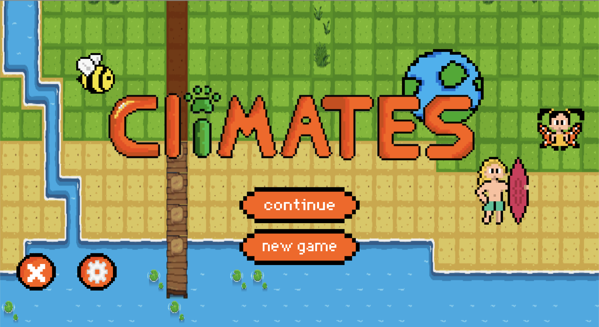
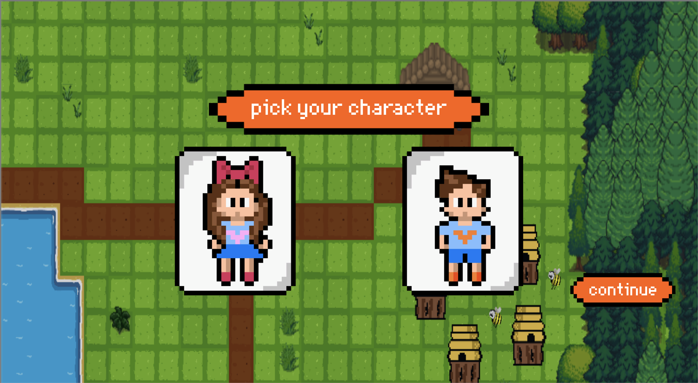
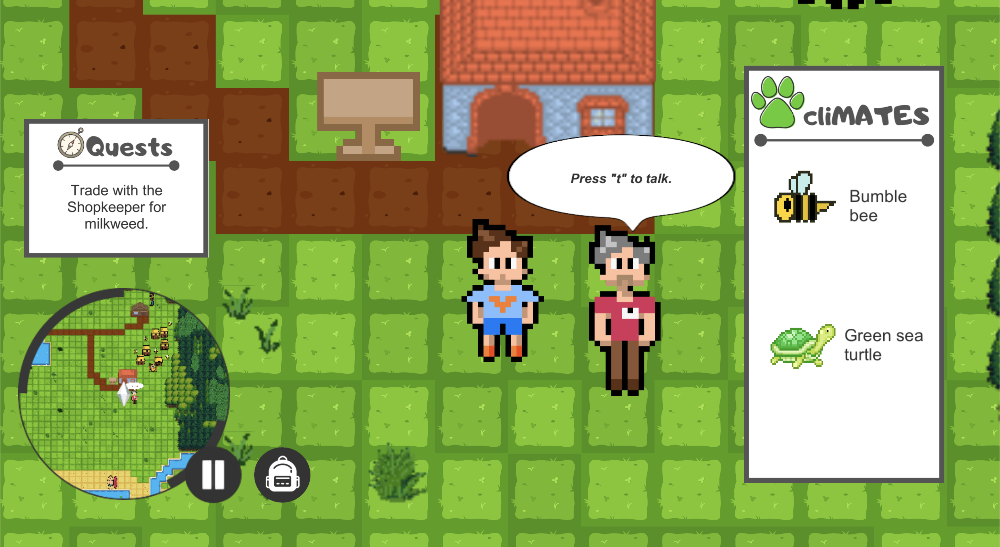
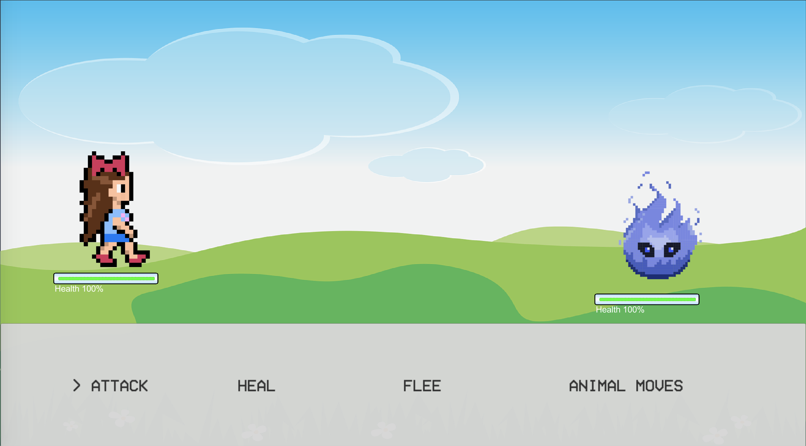

# CliMates – A game about climate change 
This serious game concept game is developed as part of the SE306 course and is made with the Unity Game Engine. 

## What is this game about
In CliMATEs you play as a kid from a small town in a world affected by the ongoing effects of climate change and global warming. You vitness the harm climate change has on your environment and seek to help out and do your part in reverting the damages. 
During the game you'll pick up small tips and contributions you can do to help, whilst also slowly discovering that the real climate parasites can't be stopped by simply planting flowers. 

## Group members
| Github username | University user name |
|---|---|
| dder725 | Daria Derecha (dder725) | 
| jason-mak | Jason Mak (cmak623) |
| lolagarden | Lola Garden (lgar863) |
| magnusrand | Magnus Rand (cran263) |
| rmoradc | Rupert Moran-Adcokck (rmor188) |
| tia365 | Tia Saunders (tsau354) |
| willHol | Will Holmes (whol106) |

## Screenshots

## Set up

## How to play
To play this game, press "New Game" on the start menu and you will be taken into the first world. The character moves around with either the arrow keys or WASD. The first objective will then be available in your 'Quest log' on the left. The Mum is the NPC closest to the player on spawn. Read the dialouge carefully and make your way through the different quests til the end!

## Objective clarifications
1. When talking to an NPC after pressing 't', you press 'Enter' to advance through the conversation. Making this more intuitive will be done in the next iteration
2. After talking to the saleperson and getting flower seeds, you need to remember to return to the Mum for the objective to complete, updates will be made to the quest log in the next iteration to clarify objectives like this.
3. Press 'Space' to plant flowers. Making this more intuitive will be done in the next iteration
4. It is left to the player to find the beach to encourage exploration.
5. If the player collides with a monster, combat mode is triggered 
6. Select an action to be performed in combat by pressing Enter. In prototype, the only implemented move is "Attack"
7. Follow instructions in the message box at the bottom of the screen to exit the combat when the monster is defeated

## About the game and the development
### Game specifications 
This 2D RPG-game is made with a focus on Climate Change. The game consists of two levels, each with their own set of objectives to complete. The game has two main parts to it in each level: 
- Objective solving in an open world
- Fighting an enemy in Combat Mode

### Development and technical spesific
This game is developed using Unity. <Add something more about technicalities about the game here>

#### Map Generation 
For generating the map, Unity's TileMap feature was chosen. This allows us to premake different tiles and use a brush to paint them on a `TileMap`. TileMap also supports layers with ECS, so components such as collision box can be added to entire layers. For more complex map features such as water, the RuleTile from Unities add-on [2D extras](https://github.com/Unity-Technologies/2d-extras) was chosen. A RuleTile allows you to define patterns for different tiles which as a whole draws a more complex shape. All assets used in the project are either found for free on different assets sites on the Internet or YouTube, or made ourselves.
  
#### Managers
The game utelizes several managers, including `ObjectiveManager`, `EventManager` and `TutorialManager`. These work as the overreaching component for their area of responsebility. E.g. the `ObjectiveManager` keeps track of the different `Objective` classes and when each one should be run.  

#### HUD
The HUD system is developed using the build in UI GameObject in Unity. This uses a Canvas with an overlay rendering setting, which allows it to be rendered on top of what ever is rendered by the `MainCamera`. 
