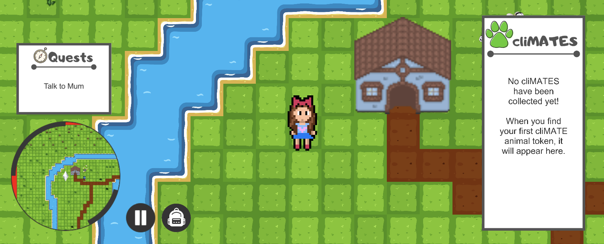

# CliMates – A game about climate change 

| Github username | University user name |
|---|---|
| dder725 | Daria Derecha (dder725) | 
| jason-mak | Jason Mak (cmak623) |
| lolagarden | Lola Garden (lgar863) |
| magnusrand | Magnus Rand (cran263) |
| rmoradc | Rupert Moran-Adcokck (rmor188) |
| tia365 | Tia Saunders (tsau354) |
| willHol | Will Holmes (whol106) |

## Screenshots

## Set up

## How to play
To play this game, press "New Game" on the start menu and you will be taken into the first world. The character moves around with either the arrow keys or WASD. The first objective will then be available in your 'Quest log' on the left. The Mum is the NPC closest to the player on spawn. 

## Objective clarifications
1. When talking to an NPC after pressing 't', you press 'Enter' to advance through the conversation. Making this more intuitive will be done in the next iteration
2. After talking to the saleperson and getting flower seeds, you need to remember to return to the Mum for the objective to complete, updates will be made to the quest log in the next iteration to clarify objectives like this.
3. Press 'Space' to plant flowers. Making this more intuitive will be done in the next iteration
4. It is left to the player to find the beach to encourage exploration.
5. If the player collides with a monster, combat mode is triggered 
6. Select an action to be performed in combat by pressing Enter. In prototype, the only implemented move is "Attack"
7. Follow instructions in the message box at the bottom of the screen to exit the combat when the monster is defeated

